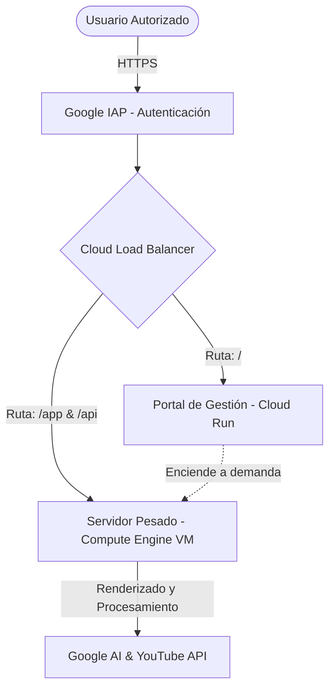
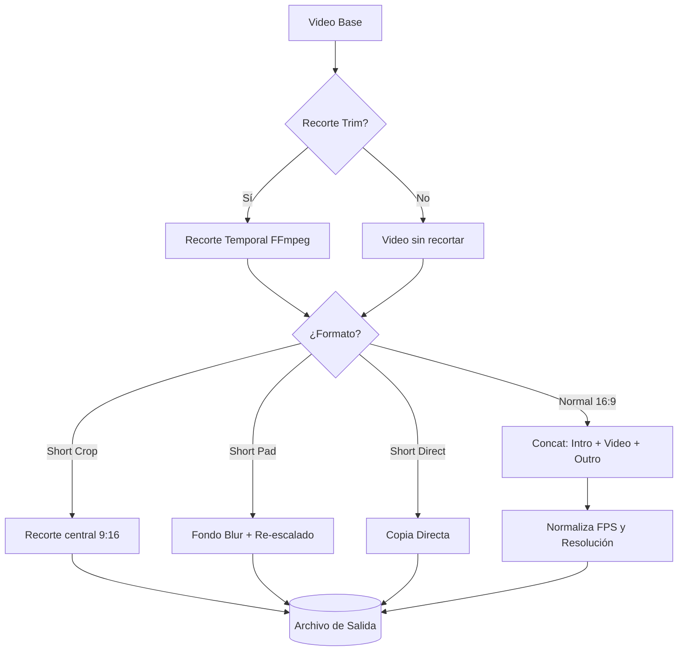

# Documentación Técnica: Pipeline YouTube Automático (V2)

Este documento detalla la arquitectura, flujos de datos y lógica interna del sistema automatizado de procesamiento y publicación de videos de Pronectis.

---

## 1. Arquitectura de Nube (Google Cloud Platform)

El sistema opera bajo un entorno híbrido de **alta disponibilidad y bajo costo** (Serverless + Compute Engine On-Demand), gestionado por un Load Balancer. El acceso está protegido criptográficamente mediante **Google IAP (Identity-Aware Proxy)**, exigiendo cuentas corporativas autorizadas.



### Componentes de Infraestructura:
1. **Load Balancer & IAP:** Actúa como el portero (Zero Trust Network Access). Encamina el tráfico a uno de los dos Backends dependiendo de la URL solicitada.
2. **Backend 1 (Cloud Run - Portal):** Interfaz ligera y gratuita (`/`) que verifica si la VM principal está prendida. Si está apagada, invoca la API de GCP para encenderla (Encendido On-Demand).
3. **Backend 2 (Compute Engine - App Principal):** Servidor Linux con alta capacidad de cómputo montado en `/app`. Contiene FastAPI, FFmpeg, dependencias pesadas y el entorno de Python.

---

## 2. Core Backend (Python & FastAPI)

El servidor pesado está estructurado en un entorno asíncrono gestionado por FastAPI y WebSockets, garantizando reactividad en tiempo real sin bloquear el motor de renderizado.

### Módulo Principal: `web_app.py`
Actúa como controlador central.
- **Middleware de Enrutamiento (`limpiar_ruta_app`):** Intercepta las llamadas de `/app` y las recorta para que las rutas internas de FastAPI funcionen como si estuvieran en la raíz `/`.
- **Filtro de Health Checks:** Ignora deliberadamente las cabeceras `User-Agent: GoogleHC` para evitar que los pings automatizados del Load Balancer interfieran con los cálculos de inactividad de usuarios.
- **WebSocket Manager (`WSManager`):** Transmite un flujo constante de logs, estados del pipeline y alertas directamente a la interfaz web (UI), logrando comunicación full-duplex.

### Máquina de Estados: `pipeline_runner.py`
Se ejecuta en un hilo separado (Thread) para evitar bloquear el servidor web. Controla las fases transicionales:
`IDLE` → `RUNNING` (Descarga y Proceso) → `WAITING_CONFIRMATION` (Detención para revisión humana) → `PUBLISHING` → `IDLE`.

### Control de Errores e Interacción Humana (Human-in-the-Loop)
Si ocurre un error no crítico en algún paso del pipeline, la ejecución del hilo principal se suspende mediante `_ask_to_continue_web`. Se emite un evento `error_prompt` al WebSocket y el backend entra en estado `WAITING_CONFIRMATION` (bloqueando el pipeline hasta por 10 minutos). El usuario recibe un modal interactivo en el frontend y puede responder:
- **Continuar (`continue`):** Se ignora el fallo del paso activo y el pipeline prosigue con el siguiente paso programado.
  *Recomendación de Uso:* Adecuado si el error se produce en pasos de la Inteligencia Artificial (redacción de textos, SEO o generación visual de miniatura), ya que estos activos no bloquean el renderizado del video y pueden ser creados o ajustados fácilmente en caliente desde el panel de revisión.
- **Cancelar (`cancel`):** Se detiene el procesamiento, se realiza un rollback inmediato borrando los archivos temporales generados y se destruye el directorio del proyecto para evitar dejar archivos huerfanos.
  *Recomendación de Uso:* Indispensable si el fallo ocurre en pasos multimedia (descarga del video original, recorte temporal o procesamiento de renderizado FFmpeg), ya que forzar la continuación resultará inevitablemente en un archivo de video corrupto, incompleto o inexistente.

---

## 3. Automatización y Procesamiento (`automate.py`)

Este módulo encapsula todo el trabajo pesado del pipeline. Se divide en cuatro grandes pilares secuenciales:

### A. Descarga y Recorte
- Utiliza `yt-dlp` para descargar la más alta calidad disponible de video y metadatos desde YouTube. Alternativamente, soporta la descarga de archivos desde Google Drive vía `gdown`, o el uso de archivos locales subidos a la carpeta temporal.
- Extrae de manera nativa los subtítulos/transcripción (`.vtt`) directamente de YouTube (si están disponibles) para obtener un contexto semántico preciso que será alimentado a la Inteligencia Artificial.
- Realiza recortes temporales precisos (Trim) al inicio y/o final del video de origen mediante FFmpeg si el usuario especifica los parámetros `trim_start` y `trim_end`.

### B. Motor de Edición (FFmpeg Nativo)
En lugar de depender de plataformas de terceros con elevados costos de procesamiento, se utiliza `static-ffmpeg`. El motor procesa el video de origen según el formato seleccionado:



*Nota:* La normalización y filtro de FPS y resolución solo se aplican de forma global durante la concatenación en formato Normal 16:9 y durante el re-escalado con desenfoque de fondo en Short Pad. Short Crop y Short Direct conservan la tasa de cuadros y dimensiones proporcionales del video fuente sin forzar conversión de FPS.

### C. Inteligencia Artificial (Gemini 2.5 & 3.1)
Integración nativa con `google-genai` para el procesamiento del contenido multimedia:
- **Generación de Textos (Gemini 2.5 Flash):** Recibe la transcripción del video + el "contexto" del usuario y redacta de forma unificada el Título SEO, la Descripción Corporativa y las Etiquetas (Tags). También se utiliza este modelo para la regeneración interactiva de campos de texto específicos.
- **Miniaturas Multimodales (Gemini 3.1 Flash-Image):** Genera una portada en alta resolución a partir de un prompt rígido que bloquea explícitamente "alucinaciones" de texto de la IA.
- **Superposición de Logotipo (Pillow):** A través del endpoint manual `/api/apply-logo`, Python (Pillow) superpone el logo corporativo transparente (`Logo Pronectis Color.png`) sobre la esquina superior derecha del arte generado. *Esta acción no es automática del pipeline inicial; requiere el gatillo del usuario en el panel de revisión.*

### D. Publicación (YouTube API v3)
- Utiliza `MediaFileUpload` de forma "Resumable" mediante Chunks asíncronos para evitar caídas de red al subir archivos masivos de Gigabytes.
- Permite la asignación del video a listas de reproducción (Playlists) específicas definidas por el canal del usuario y asocia la miniatura final.

---

## 4. Gestión de Eficiencia: Sistema de Auto-Apagado

La máquina virtual está diseñada para **suicidarse (apagarse) de forma controlada** si el usuario la abandona, garantizando que el costo de la VM no consuma presupuesto en horas muertas (noches, fines de semana).

### Algoritmo (`_inactivity_monitor` en `web_app.py`):
1. Un bucle infinito chequea cada 60 segundos si el sistema está libre (`runner.status == "idle"`).
2. Si un procesamiento pesado está en curso, el reloj de inactividad se resetea instantáneamente (bloqueando el apagado mientras trabaja).
3. Si la máquina permanece verdaderamente ociosa (sin llamadas HTTP a la API ni actividad en el WebSocket abierto) durante **15 minutos exactos**, el backend emite una señal de alerta (`shutdown_warning`) de 30 segundos por WebSockets al navegador del usuario.
4. Si el usuario no presiona "Cancelar", Python ejecuta el comando de apagado del sistema operativo (previamente autorizado en el archivo SUDOERS de Linux):
   `os.system("sudo /sbin/shutdown -h now")`
   *(En entornos de desarrollo Windows, se ejecuta el comando `shutdown /s /t 5`)*

---

## 5. Mapeo de API Interna (FastAPI)

El sistema expone endpoints documentados para interactuar con la automatización y el panel de control:

* **Endpoints de Pipeline y Control:**
  - `POST /api/run`: Inicia un nuevo flujo de renderizado en segundo plano enviando URL de origen (YouTube o Drive) o ruta local, formato, contexto e indicación de subida automática.
  - `GET /api/status`: Devuelve el estado de la máquina de estados del pipeline (`status`, `step` y `outputs`).
  - `GET /api/logs`: Devuelve los registros de auditoría y ejecución acumulados en el paso actual.
  - `POST /api/cancel-pipeline`: Cancela inmediatamente el procesamiento del pipeline en ejecución y elimina todos los archivos temporales de trabajo.
  - `POST /api/prompt-response`: Resuelve de forma remota un aviso o bloqueo por error, indicando si se debe continuar (`continue`) o abortar (`cancel`).

* **Endpoints de Edición e IA en Caliente:**
  - `POST /api/regenerate`: Recibe instrucciones específicas del usuario y regenera de forma individual un campo de texto (título, descripción, tags) a través de Gemini 2.5 Flash.
  - `POST /api/regenerate-thumbnail`: Genera una nueva portada visual usando IA a partir de las instrucciones ingresadas por el usuario.
  - `POST /api/apply-logo`: Fusiona el logo corporativo sobre la miniatura activa usando la biblioteca Pillow.
  - `POST /api/upload-thumbnail`: Permite al usuario subir una imagen local de miniatura para reemplazar la portada del proyecto.

* **Endpoints de Recursos e Historial:**
  - `GET /api/history`: Devuelve los últimos 5 proyectos almacenados localmente y sus estados correspondientes, ordenados por fecha de modificación.
  - `GET /api/outputs/{filename:path}`: Sirve estáticamente los videos, descripciones, títulos y miniaturas generadas por cada proyecto.
  - `GET /api/playlists`: Obtiene las listas de reproducción disponibles del canal de YouTube asociado.
  - `POST /api/upload-youtube`: Publica manualmente en YouTube un video ya renderizado usando los metadatos y miniatura presentes en el panel de revisión.

* **Endpoints de Sistema y Configuración:**
  - `GET /api/settings` y `POST /api/settings`: Permite obtener o actualizar la configuración corporativa base (landings webs de referencia y plantillas de descripciones/títulos).
  - `POST /api/shutdown`: Apaga manualmente e inmediatamente la instancia de la Máquina Virtual.

---

## 6. Esquema de Datos y Persistencia Local

Cada procesamiento se encapsula bajo un nombre de proyecto procedural en el directorio `/outputs/<nombre_proyecto>/`. Para mantener la persistencia y permitir retomar proyectos pausados o finalizados, se genera un archivo `metadata.json`.

**Estructura típica de `metadata.json`:**
```json
{
  "project_name": "proyecto_20260625_100000",
  "project_dir": "proyecto_20260625_100000",
  "source_url": "https://youtu.be/...",
  "created_at": "20260625_100000",
  "status": "done",
  "video": "proyecto_20260625_100000/video.mp4",
  "titulo": "Título Generado",
  "descripcion": "Descripción SEO...",
  "tags": "tag1, tag2",
  "thumbnail": "proyecto_20260625_100000/thumbnail.jpg",
  "titulo_file": "proyecto_20260625_100000/titulo.txt",
  "desc_file": "proyecto_20260625_100000/descripcion.txt",
  "video_format": "normal",
  "youtube_id": "xxxxx",
  "youtube_url": "https://youtu.be/xxxxx",
  "error_detail": "Mensaje de excepción detallado (presente únicamente si status es 'error')"
}
```

### Mantenimiento y Poda de Disco (Disk Pruning)
Para evitar el desbordamiento de almacenamiento en el disco de la VM (considerando que los renders y descargas de video pueden pesar Gigabytes), el pipeline integra una función automática de limpieza llamada `_prune_old_projects` en `pipeline_runner.py` (Línea 569).
- Cada vez que se arranca una ejecución del pipeline, el hilo principal escanea `/outputs/` y recopila todas las carpetas que contienen un archivo `metadata.json` válido.
- Estas carpetas se ordenan según su fecha de última modificación (`st_mtime`).
- La función elimina de forma recursiva (`shutil.rmtree`) las carpetas de proyectos más antiguas hasta dejar únicamente los últimos **5 proyectos activos en el disco**.
- Los metadatos de las carpetas eliminadas desaparecen, lo que mantiene el historial del frontend acotado estrictamente a los últimos 5 elementos disponibles en almacenamiento.

---

## 7. Despliegue y Autenticación Continua

1. **Auto-Start de la VM:** La máquina virtual en Compute Engine está configurada mediante scripts de inicio (`startup scripts` o cron `@reboot`) para levantar automáticamente el servidor Uvicorn/FastAPI apenas Google Cloud enciende la instancia.
2. **Dependencias:** Requiere Python 3.10+, `ffmpeg` (instalado a nivel sistema en el Dockerfile o resuelto vía paquete `static-ffmpeg`), y un archivo `.env` que contenga la clave `GEMINI_API_KEY`.
3. **Autenticación OAuth 2.0 (YouTube):**
   - El sistema requiere los archivos `client_secrets.json` (credenciales de la aplicación en la consola de Google Cloud) y `youtube_token.pickle` (token de sesión del usuario con los permisos de subida).
   - El programa está diseñado para re-autenticar y refrescar el token de forma automática ("eterna") sin intervención humana utilizando `google-auth-oauthlib`.
   - **Troubleshooting:** Si por políticas de Google el token expirara de forma irreversible, se provee un script auxiliar (`generate_youtube_token.py`) que el desarrollador puede ejecutar manualmente por consola para forzar un nuevo login interactivo y regenerar el archivo `youtube_token.pickle`.

---

## 8. FAQ y Resolución de Problemas (Troubleshooting Técnico)

A continuación se listan los problemas de infraestructura y ejecución del pipeline reales identificados y sus respectivos protocolos lógicos de resolución.

### Q1: Error `invalid_grant` al subir videos a la API de YouTube
* **Síntoma:** El pipeline falla en el paso 4 o la subida manual reporta error indicando: `google.auth.exceptions.RefreshError: ('invalid_grant: Token has been expired or revoked.', ...)`.
* **Causa:** El token almacenado en `youtube_token.pickle` está diseñado para ser de refresco permanente. Sin embargo, puede expirar o ser revocado ante acciones de seguridad o auditorías de YouTube/Google sobre los permisos concedidos a la aplicación.
* **Solución:**
  1. Para renovar la sesión OAuth, **es indispensable acceder a la VM a través de Escritorio Remoto (RDP)**. No se puede realizar por consola SSH directa ya que el flujo de Google requiere levantar un navegador visual interactivo en la máquina virtual.
  2. Abrir la terminal gráfica en el escritorio remoto y ejecutar el script interactivo: `python generate_youtube_token.py`.
  3. Esto abrirá una ventana emergente de Google YouTube en el navegador web del sistema.
  4. Iniciar sesión y autorizar los accesos con la cuenta corporativa.
  5. Al finalizar la autenticación gráfica, el script guardará el nuevo token permanente sobrescribiendo el archivo `youtube_token.pickle` en el directorio de la aplicación.

### Q2: Error `subprocess.CalledProcessError` en FFmpeg por falta de recursos (OOM) o límites de disco
* **Síntoma:** El procesamiento en el paso 3 (Fusión o formateo) falla repentinamente. Los logs de FFmpeg muestran procesos truncados o errores del tipo `Write error: No space left on device` o `Killed`.
* **Causa:**
  - El volumen de disco `/outputs/` se encuentra al 100% de capacidad.
  - El tamaño de memoria RAM de la instancia de Compute Engine es demasiado bajo para procesar videos largos de alta resolución con múltiples filtros complejos de escalado y desenfoque.
* **Solución:**
  1. Monitorear el uso de disco del servidor con el comando `df -h`. Si el disco está saturado, liberar espacio o redimensionar el disco de la VM en GCP.
  2. Si el error es `Killed`, la VM está sufriendo de *Out Of Memory (OOM)*. Se debe escalar la máquina en GCP a una instancia con mayor cantidad de RAM (ej. pasar de una `f1-micro` o `g1-small` a una instancia de la familia `e2-standard`).

### Q3: Límites de Cuota de Gemini API (HTTP 429 - ResourceExhausted)
* **Síntoma:** Fallos en la redacción de metadatos o miniaturas con el log: `429 Online quota exceeded`.
* **Causa:** Se ha superado el límite de solicitudes por minuto (RPM) o imágenes por día de la clave API activa.
* **Solución:**
  1. Habilitar la facturación de pago por uso en el proyecto GCP para expandir los límites del tier gratuito de la API Key.
  2. De forma paliativa, el backend posee un mecanismo de fallback robusto en `generate_thumbnail_ai` (Línea 380) que, ante un fallo de Gemini para imágenes, redirige automáticamente la solicitud al motor externo de Pollinations.ai para evitar que el pipeline del usuario se rompa.
